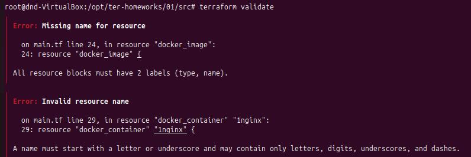
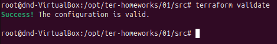

# Домашнее задание к занятию "`Введение в Terraform`" - `Дедюрин Денис`

---
## Задание 1.

1. Перейдите в каталог src. Скачайте все необходимые зависимости, использованные в проекте.
1. Изучите файл .gitignore. В каком terraform-файле, согласно этому .gitignore, допустимо сохранить личную, секретную информацию?(логины,пароли,ключи,токены итд)
1. Выполните код проекта. Найдите в state-файле секретное содержимое созданного ресурса random_password, пришлите в качестве ответа конкретный ключ и его значение.
1. Раскомментируйте блок кода, примерно расположенный на строчках 29–42 файла main.tf. Выполните команду terraform validate. Объясните, в чём заключаются намеренно допущенные ошибки Исправьте их.
1. Выполните код. В качестве ответа приложите: исправленный фрагмент кода и вывод команды docker ps.
1. Замените имя docker-контейнера в блоке кода на hello_world. Не перепутайте имя контейнера и имя образа. Мы всё ещё продолжаем использовать name = "nginx:latest". Выполните команду terraform apply -auto-approve. Объясните своими словами, в чём может быть опасность применения ключа -auto-approve. Догадайтесь или нагуглите зачем может пригодиться данный ключ? В качестве ответа дополнительно приложите вывод команды docker ps.
1. Уничтожьте созданные ресурсы с помощью terraform. Убедитесь, что все ресурсы удалены. Приложите содержимое файла terraform.tfstate.
1. Объясните, почему при этом не был удалён docker-образ nginx:latest. Ответ ОБЯЗАТЕЛЬНО НАЙДИТЕ В ПРЕДОСТАВЛЕННОМ КОДЕ, а затем ОБЯЗАТЕЛЬНО ПОДКРЕПИТЕ строчкой из документации terraform провайдера docker. (ищите в классификаторе resource docker_image )

### Ответ:

Согласно файлу.gitignore

```
# Local .terraform directories and files
**/.terraform/*
.terraform*

!.terraformrc

# .tfstate files
*.tfstate
*.tfstate.*

# own secret vars store.
personal.auto.tfvars
```
Допустимо сохранить личную, секретную информацию в файле personal.auto.tfvars

Выполняем иницализацию проекта, создаем план и применяем изменения командами:
```
terraform init
terraform plan
terraform apply
```


В state-файле секретное содержимое созданного ресурса random_password имеет следующее значение:
```
"result": "6uJbptLYbNv5cQIj"
```


Раскометруем блок, указанный в задании, и выполняем команду:
```
terraform validate
```
Получаем следующие ошибки:


Текст ошибкки говорит о том, что
1. Отсутствует имя для ресурса docker_image.
```
resource "docker_image" {}
```
Правильное значение должно быть например такое:
```
resource "docker_image" "nginx" {}
```
2. Неверное имя ресурса docker_container.
```
resource "docker_container" "1nginx" {}
```
Имена ресурсов не могут начинаться с цифры. Переименовываем:
```
resource "docker_container" "nginx_container" {}
```
После исправления ошибок и повторном запуске команды получаем еще одну ошибку:

Ошибка говорит о том что неверная ссылка на атрибут ресурса. Код пытается сослаться на несуществующий ресурс random_password.random_string_FAKE.
```
name  = "example_${random_password.random_string_FAKE.resulT}"
```
Исправляем на: 
```
name  = "example_${random_password.random_string.result}"
```
Проверяем в очередной раз на наличие ошибок. Ошибок нет.

Теперь исправленный файл main.tf выглядит так:
```
terraform {
  required_providers {
    docker = {
      source  = "kreuzwerker/docker"
      version = "~> 3.0.1"
    }
  }
  required_version = ">=1.8.4" /* Многострочный комментарий.
  Требуемая версия terraform */
}

provider "docker" {}

# однострочный комментарий

resource "random_password" "random_string" {
  length      = 16
  special     = false
  min_upper   = 1
  min_lower   = 1
  min_numeric = 1
}

resource "docker_image" "nginx" {
  name         = "nginx:latest"
  keep_locally = true
}

resource "docker_container" "nginx_container" {
  image = docker_image.nginx.image_id
  name  = "example_${random_password.random_string.result}"

  ports {
    internal = 80
    external = 9090
  }
}
```
Снова выполняем:
```
terraform plan
terraform apply
```


Выпролняем команду:
```
docker ps
```

Видим, что контейнер с именем example_6uJbptLYbNv5cQIj успешно запустился.

Изменяем имя контейнера на hello_world в блоке:
```
resource "docker_container" "nginx_container" {
  image = docker_image.nginx.image_id
  name  = "hello_world"

  ports {
    internal = 80
    external = 9090
  }
}
```
Выполняем команду:
```
terraform apply -auto-approve
```

Выпролняем команду:
```
docker ps
```


Ключ **-auto-approve** пропускает подтверждение применения изменений, что обычно требуется для команды terraform apply. То есть, Terraform сразу выполняет действия, указанные в плане, без ожидания ввода пользователя.
Опасность использования данного ключа может быть связана с тем, что Terraform может применить изменения, которые мы не хотели вносить, например, уничтожение или изменение критичных ресурсов, т.е. в этом случаае мы не получим возможность перепроверить план перед применением.

А полезность данного ключа заключается в том, что он позволяет автоматически применять изменения без ручного подтверждения, что удобно для сценариев автоматизации (например, в Jenkins, GitLab CI/CD), где нет возможности вводить подтверждение вручную, а так же тестирования, где ошибки не критичны.